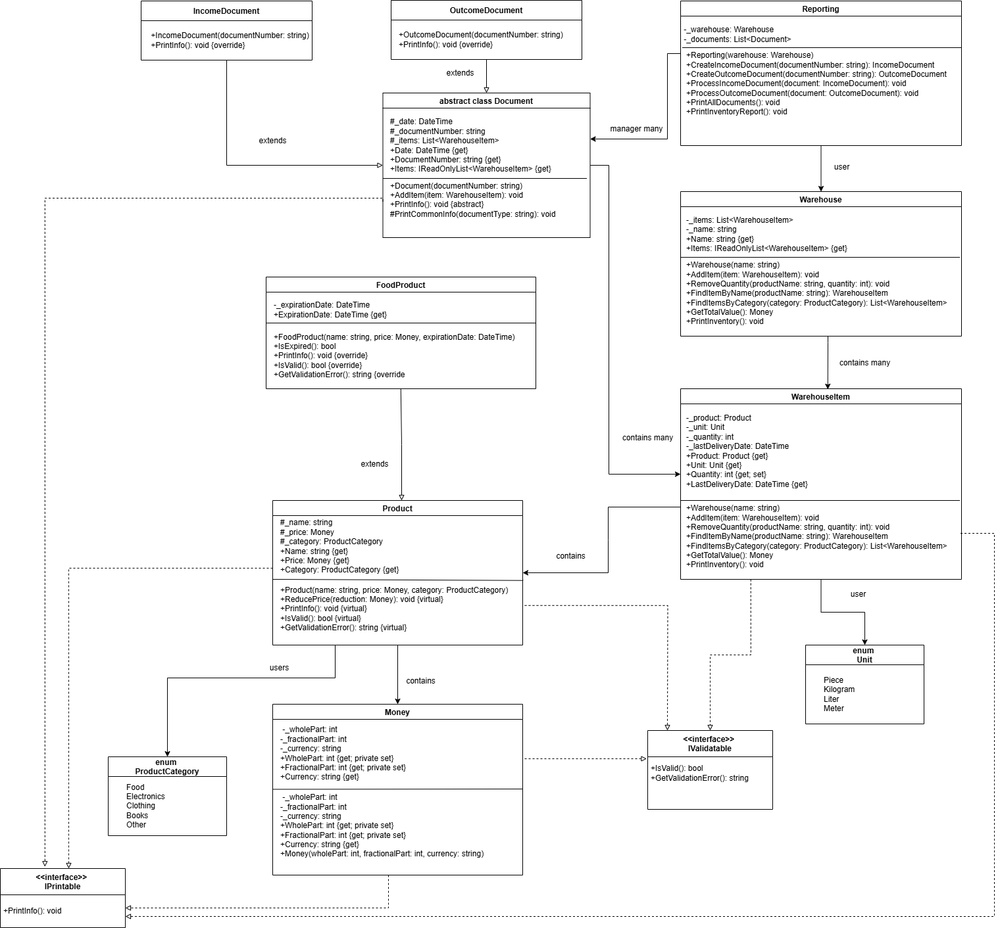
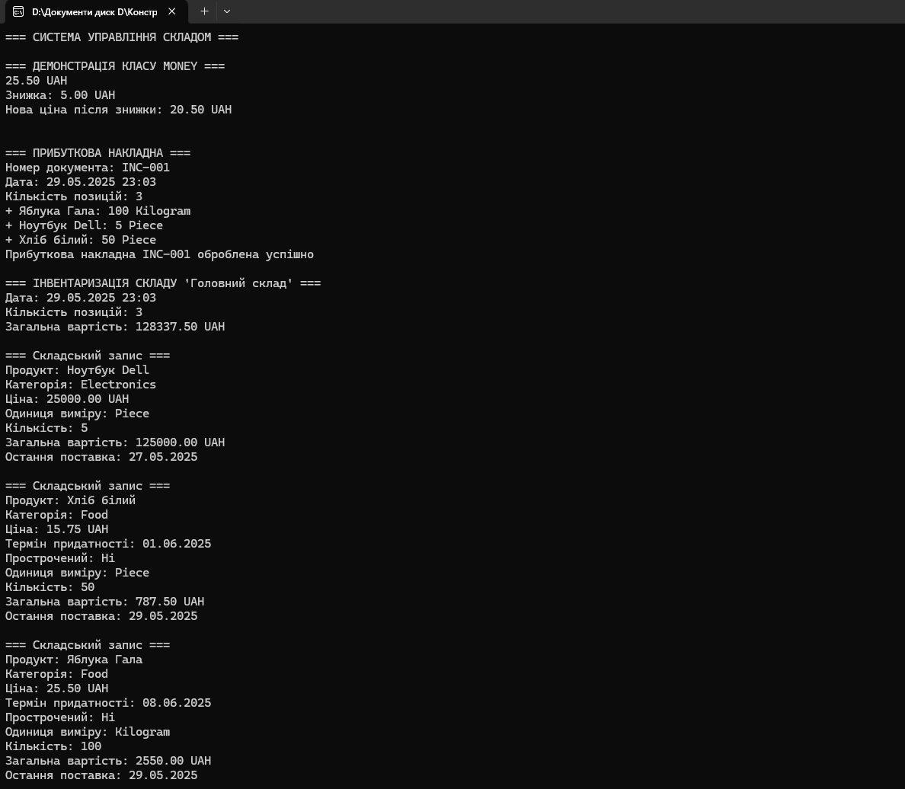
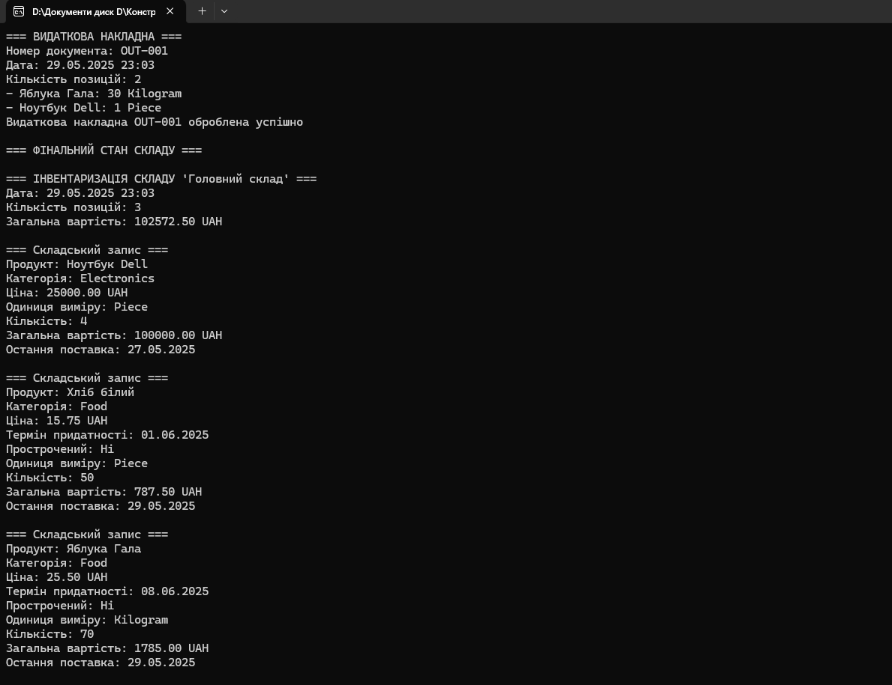
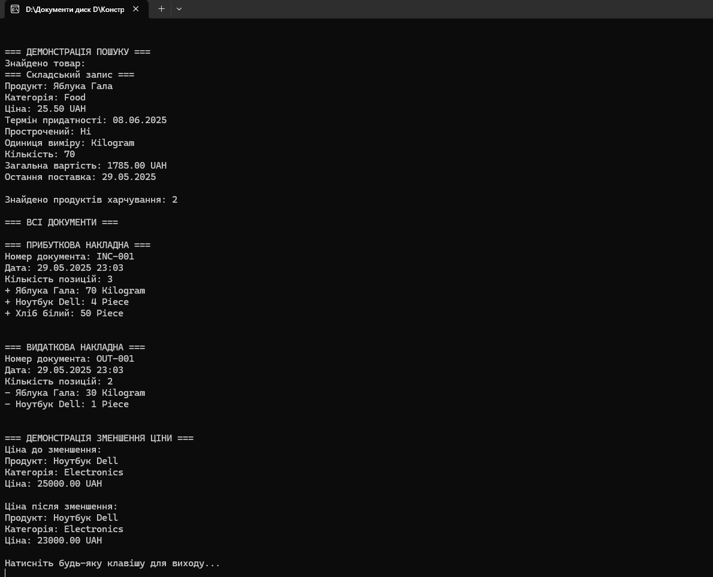

# Система управління складом

Цей проєкт демонструє реалізацію принципів об'єктно-орієнтованого програмування в системі управління складом.

## Реалізовані принципи програмування

### 1. DRY (Don't Repeat Yourself) — Не повторюйся

- **[IValidatable.cs](./lab1/IValidatable.cs)** — інтерфейс валідації, що використовується в `Money`, `Product`, `WarehouseItem`
- **[IPrintable.cs](./lab1/IPrintable.cs)** — інтерфейс для виведення інформації
- **[Document.cs](./lab1/Document.cs)** — абстрактний клас з базовою логікою документів, наслідується в `IncomeDocument` і `OutcomeDocument`

### 2. KISS (Keep It Simple, Stupid)

- Простота класів: кожен клас має чітку відповідальність
- Прості методи: `AddQuantity`, `RemoveQuantity`
- Назви методів: `GetTotalValue`, `IsExpired`, `PrintInventory`

### 3. Принципи SOLID

#### 3.1 SRP — Принцип єдиної відповідальності

- **[Money.cs](./lab1/Money.cs)** — грошові операції
- **[Product.cs](./lab1/Product.cs)** — дані продукту
- **[WarehouseItem.cs](./lab1/WarehouseItem.cs)** — управління одиницею на складі
- **[Warehouse.cs](./lab1/Warehouse.cs)** — колекція складських позицій
- **[Reporting.cs](./lab1/Reporting.cs)** — створення звітів

#### 3.2 OCP — Принцип відкритості/закритості

- **[FoodProduct.cs](./lab1/FoodProduct.cs)** розширює `Product`
- **[IncomeDocument.cs](./lab1/IncomeDocument.cs)** та **[OutcomeDocument.cs](./lab1/OutcomeDocument.cs)** розширюють `Document`

#### 3.3 LSP — Принцип підстановки Лісков

- `FoodProduct` використовується як `Product`
- Поліморфізм `Document` у **[Reporting.cs](./lab1/Reporting.cs)**

#### 3.4 ISP — Принцип розділення інтерфейсів

- **[IPrintable.cs](./lab1/IPrintable.cs)** — тільки методи для виводу
- **[IValidatable.cs](./lab1/IValidatable.cs)** — тільки методи валідації

#### 3.5 DIP — Принцип інверсії залежностей

- **[Reporting.cs](./lab1/Reporting.cs)** залежить від `Warehouse` через ін'єкцію конструктора
- Методи працюють через інтерфейси: `IPrintable`, `IValidatable`

### 4. YAGNI — Тобі це не знадобиться

- Лише необхідна функціональність
- Прості **[enum ProductCategory.cs](./lab1/ProductCategory.cs)** та **[enum Unit.cs](./lab1/Unit.cs)**

### 5. Composition Over Inheritance — Композиція замість наслідування

- **[Reporting.cs](./lab1/Reporting.cs)** містить `Warehouse`, а не наслідує
- **[WarehouseItem.cs](./lab1/WarehouseItem.cs)** містить `Product`
- **[Money.cs](./lab1/Money.cs)** використовується як складова інших класів

### 6. Program to Interfaces Not Implementations

- Інтерфейси для контрактів:
  - `IPrintable`, `IValidatable`
  - Використання `IReadOnlyList` для доступу до колекцій

### 7. Fail Fast — Швидка помилка

- Валідація в конструкторах, властивостях, методах
- Уніфікована валідація через `IValidatable`

### 8. Патерни проєктування

#### Factory Method

- Статичний метод `Money.FromDecimal()` створює об'єкти

#### Template Method

- **[Document.cs](./lab1/Document.cs)** має шаблонний метод `PrintCommonInfo()`

---

## Основні класи

| Клас                                                                                                    | Призначення                              |
| ------------------------------------------------------------------------------------------------------- | ---------------------------------------- |
| **[Money.cs](./lab1/Money.cs)**                                                                         | Грошові значення, операції, валюта       |
| **[Product.cs](./lab1/Product.cs)** / **[FoodProduct.cs](./lab1/FoodProduct.cs)**                       | Продукти, включно з терміном придатності |
| **[WarehouseItem.cs](./lab1/WarehouseItem.cs)**                                                         | Одиниці зберігання на складі             |
| **[Warehouse.cs](./lab1/Warehouse.cs)**                                                                 | Колекція складських позицій              |
| **[Document.cs](.lab1//Document.cs)**                                                                   | Абстракція документа                     |
| **[IncomeDocument.cs](./lab1/IncomeDocument.cs)** / **[OutcomeDocument.cs](./lab1/OutcomeDocument.cs)** | Документи приходу / витрат товарів       |
| **[Reporting.cs](./lab1/Reporting.cs)**                                                                 | Обробка документів і генерація звітів    |

---

## Тестування функціональності

Демонстрація реалізації доступна через головний метод у **[Program.cs](./lab1/Program.cs)**:

- Операції з грошима
- Робота з продуктами та категоріями
- Управління складом
- Створення і обробка документів
- Пошук за назвою / категорією
- Валідація та обробка винятків

## 📱 Скріншоти

---

## Результат виконання програми

## Результат виконання програми

## Результат виконання програми

## Результат виконання програми

## 🧑‍💻 Автор

**Качур Віталій Васильович**, ВТк-24-1
